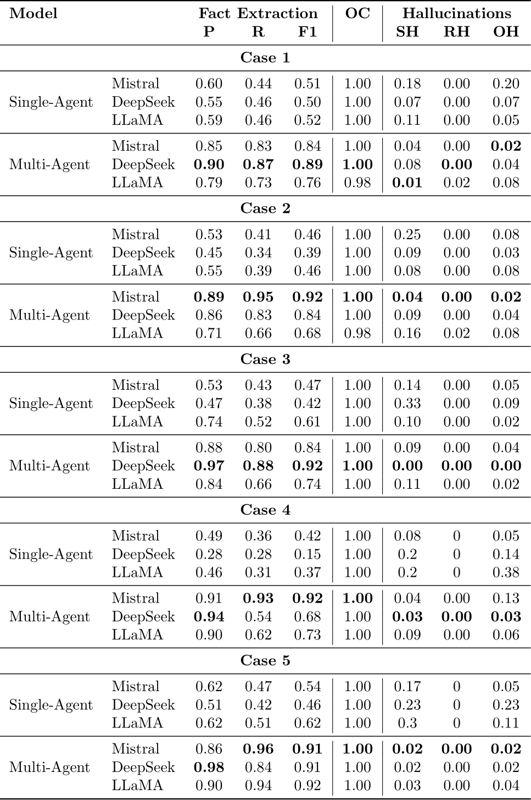

# PATCHES : A Framework for Contextualizing ADHD Symptoms Manifestations

This is the repository for `PATCHES : A Framework for Contextualizing ADHD Symptoms Manifestations`.
 This study introduce a complete framework designed to support clinical reasoning for Contextualizing the manifestations of ADHD symptoms.

**Note:** Due to the confidentiality of medical data, all personal patient information has been replaced with fictitious data.

---

## Semantic Model


---

## The population System


---

## Results of Knowledge extraction

The experimental evaluation is based on data from five ADHD-diagnosed patients.
Diagnostic reports were collected in collaboration with a doctor, in PDF format. The information about planning is in JSON format. Check the experimentation files in `./Experimentation_Data/`.
The following table present for each case, the value of Precision (P), Recall (R), F1-score, Ontology Conformance (OC), Subject/Relation/Object Hallucinations (SH/RH/OH).
Numbers in bold identify the best results for each case.



---

## Repo content
The structure of the repo is as the following.

- [Experimentation_Data](Experimentation_Data) : Contains the source documents used for ontology population. This includes medical diagnostic reports in PDF format and activity schedules in JSON format.
- [Multi_Agent](Multi_Agent) :  Contains the outputs and evaluation results of our multi-agent system.
    - [Profile Crew](Multi_Agent/Profile_Crew) :Stores the outputs generated by the agent team responsible for extracting data from the Profile module. Organized by the use cases, each subfolder includes the outputs for the three tested models: DeepSeek, Mistral, and LLama.
    - [Module Crew](Multi_Agent/Module_Crew/) : Stores the outputs generated by the agent team responsible for extracting data from the other ontology modules. Similarly, the results are organized by the use cases and include outputs for DeepSeek, Mistral, and LLama.
    - [Aggregated output](Multi_Agent/Aggregated_output/) : Contains the merged outputs from both agent teams, representing the complete set of extracted RDF triples. This folder also includes the corresponding ground truth data for each use case.
    - [Evaluation](Multi_Agent/Evaluation/) : Contains the evaluation results comparing the extracted triples to the ground truth, organized by use case and model.
    - [Pydantic_Types](Multi_Agent/Pydantic_Types): contains the Pydantic models for the seven modules. These types are used to guide the agents in generating instances and triples that comply with the ontology schema.
- [Mono_Agent](Mono_Agent) : Contains the outputs and evaluation results of the state-of-the-art single LLM-based approach.
    - [Generated_triples](Mono_Agent/Generated_triples) : Includes the RDF triples generated by the single LLM in response to input prompts.
    - [Evaluation_results](Mono_Agent/Evaluation_results) : Stores the evaluation results assessing the accuracy, conformity, and hallucination rates of the triples generated by the single LLM.
    - [`CaseX_situation_description.txt`](Mono_Agent/Case1_situation_description.txt) : This file provides a narrative description of a specific situation involving the child. It is generated by combining contextual information from the child’s activity schedule (timetable) and relevant positive signs extracted from the diagnostic report.
    - [`CaseX_situation_prompt.json`](Mono_Agent/Case1_situation_prompt.json) : This file contains the prompt used in the single LLM configuration. It merges the situation description with the ontology modules and includes an example of expected triple extraction to guide the model.
- [Ontology](Ontology) : The modular ontology used in this study.
    - `Person` : This module includes personal details (e.g., name, gender, birthdate) and information about individuals present during an activity, which helps contextualize the situation.
    - `Activity` : This module captures the patient's ongoing activities, critical for interpreting behavior.
    - `Environnement` : This module identifies the spatial context (learning, living, social, or play settings).
    - `Challenge` : This module lists difficulties commonly reported by caregivers or teachers, including academic, social, emotional, or environmental issues.
    - `Time` : This module defines temporal context using instants and intervals (with start and end times).
    - `Situation` : This module categorizes events requiring contextualization and links them to related elements across modules through defined properties and relationships.
    - `Profile` : This module models the patient's health status using diagnostic form data, such as ADHD type, symptoms, and comorbidities.
- [src](src) : Contains the code of our multi-agent system. As the medical reports we process are in French, the prompts have been designed in the same language.
  - [parsing tool](src/ontology_population_project/tools/parsing_tool.py): We use [LLamaParse](https://www.llamaindex.ai/llamaparse), an LLM-powered tool integrated into the agent workflow to extract structured text from PDF medical reports. It serves as the initial step in the knowledge extraction pipeline.
  - agents configuration ([profile crew](src/ontology_population_project/crew/profile_crew/config/agents.yaml), [module crew](src/ontology_population_project/crew/modules_crew/config/agents.yaml)): Each agent is configured using YAML syntax that defines its role, objectives, and behavioral instructions. This modular setup allows precise control over the agent’s actions.
  - task configuration ([profile crew](src/ontology_population_project/crew/profile_crew/config/tasks.yaml), [module crew](src/ontology_population_project/crew/modules_crew/config/tasks.yaml)): Tasks are also defined via YAML. Each task includes the agent responsible, a description, and the tools required, enabling flexible and scalable task orchestration.
  - [pydantic types](src/ontology_population_project/pydantic_types): We leverage Pydantic models for semantic control. These models ensure that each agent operates strictly within the ontological schema associated with its module. This constraint minimizes semantic drift and improves the relevance and consistency of the extracted outputs.
- Configuration Files:
  - `pyproject.toml`: Defines the python project structure and lists the required dependencies for running the application using the `crewAI` framework.
  - `Dockerfile`: Specifies the instructions to build the Docker image, including the installation of necessary dependencies, tools, and environment setup for the ontology population system.
  - `docker-compose.yml`: Orchestrates multiple Docker containers and services, including the application itself, LLM dependencies, and any supporting services, providing a unified environment for development and deployment.
  - `entrypoint.sh`: A shell script that contains startup commands automatically executed when the containers are launched. It ensures that necessary services and environment variables are initialized correctly before the application starts.

---

## Installation
Prerequisites :
* Docker

### How to Run the Code

To run the application, follow these steps:

1.  (Optional) Create the `.env` file from the provided example:

2. (Optional) Set the API keys in the `.env` file:

  * The LLM API key (e.g., `MISTRAL_API_KEY`)
  * The LLamaParse API key (`LLAMA_CLOUD_API_KEY`)

3. Build and start the Docker container using the following command:

   ```bash
   docker-compose up --build
   ```
**Note:** This command will automatically build the Docker image, create the container, and install all necessary dependencies for the application.

Once the process completes successfully, you can directly access the Gradio interface and:

* **View the results of our experiments** via the **ProfileCrew History** and **ModuleCrew History** tabs.
* **Re-run the evaluation** of these experiments using the **Evaluation** tab to visualize the outcomes.


### Manual Execution in the Docker Container

To manually connect to the container and run the code:

   ```bash
   docker-compose start
   ```

You can directly access the Gradio interface.

## Launch the Gradio interface in your browser
Once Gradio is launched, open your browser at the following address:

```bash
http://localhost:7860
```
Description of Gradio Interface Tabs :

* **New Analysis Tab**:
  This tab allows you to run the complete knowledge extraction pipeline from a PDF medical report and a planning file in Excel format (Check the example files in `./experimentation_data/`). To launch the process, follow these steps:

  * Select the medical report in PDF format (*PDF File* section).
  * Enter the patient's **name** (*Patient Name* section).
  * Enter the planning in JSON format (*Planning Data* section).
  * Click the **Launch Pipeline** button to start the knowledge extraction process.

* **Profile History Tab**:
  This tab displays previously generated results for the *Profile* module. It allows you to review past extractions without re-running the pipeline. Several of our experimental cases are already included.

* **Module History Tab**:
  This tab shows previously generated results for the other modules (*Activity, Challenge, Person, Environment, Time,* and *Situation*). It enables result viewing without repeating the extraction process. Some of our experimental cases are preloaded.

* **Evaluation Tab**:
  This tab allows you to evaluate the LLM-generated outputs against manually defined ground-truth data. It also includes several of our experimental evaluation results.

---
## Evaluation : cosinus similarity
To evaluate the similarity between the triples generated by the agents and the ground truth, we used the sentence-transformers model `all-MiniLM-L6-v2` ([paper](https://arxiv.org/abs/2002.10957)) as embedding model. Based on the generated embeddings, we then computed the cosine similarity, using a fixed threshold of 0.8.

---
## Illustrations from the Experimentation Phase
This section presents a selection of screenshots from the experiments we conducted. These images illustrate key steps and outputs of the system, providing a visual overview of the implementation and results.

- This screenshot shows the web interface used to upload PDF and JSON documents, which initiates the instance extraction process using our multi-agent approach.


- The second screenshot presents the interface for visualizing extraction results, allowing users to inspect the output produced by the agents.

 

- The third screenshot shows the interface for re-running the evaluation process and visualizing the corresponding results.

  

---
## Result Reproduction

The following instructions describe how to execute the complete pipeline, from document parsing to triplet extraction. Please note that results generated by LLMs may vary.

1. **API Key Configuration**: Set the API keys in the `.env` file:

  * The LLM API key (e.g., `MISTRAL_API_KEY`)
  * The LLamaParse API key (`LLAMA_CLOUD_API_KEY`)

2. **Ground Truth for Evaluation**:
   To perform evaluation, manually define the ground truth in JSON format and place it in the following folder:
   `src/ontology-population-project/agent-output/Gradio/ground-truth`.

3. **Container Setup**:
   Create or start the Docker container using the command provided earlier in this README.

4. **Access the Gradio Interface**:
   Open the Gradio interface using the link mentioned above.

